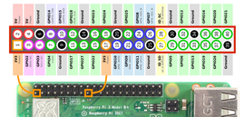

# RPiWeather
Weather forecast system using RaspberryPi

## 1. Brief Introduction
This is a RaspberryPi project built to store the **Temperature**, **Humidity** and **Pressure** data, then use the data to forcast the local whether

## 2. Hardware Preparation
I use the RaspberryPi4 B model, with [BME280 sensor](https://learn.adafruit.com/adafruit-bme280-humidity-barometric-pressure-temperature-sensor-breakout/python-circuitpython-test) as the sensor to detect the enviroment conditions (i.e. Temperature, Humidity and Pressure). The BME280 sensor uses I2C as the data transfer interface, so please make sure to enable it using raspi-config. The connection of the GPIO can be described by the following image (from AdaFruit website).

RPi GPIO connection with BME280 sensor:

Pi 3V3 <-> VIN, CS

Pi GND <-> GND

Pi SDA (GPIO2) <-> SDA

Pi SCL (GPIO3) <-> SCL

## 3. Backend database & RESTful API

We use PostgreSQL as the backend. It can be easily set up on a RPi device. The data is sampled every 10min, and stored into the database. 

Flask is used as the backend web engine. It has high flexiblity and can be easily integrated with our data sampling system.

## 4. Front End

We use react.js with SemanticUI as the frontend framework. The chart in the front end is handled by d3 library. Reqeust to RESTful server is handled by axios.
