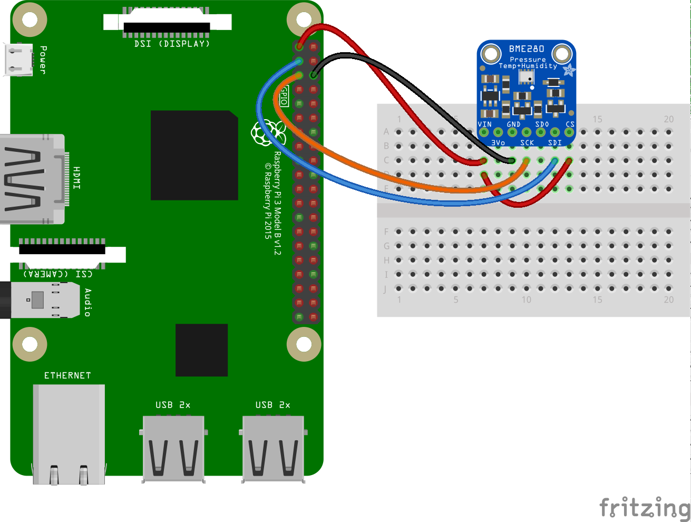

# RPiWeather
Weather forecast system using RaspberryPi

## 1. Brief Introduction
This is a RaspberryPi project built to store the **Temperature**, **Humidity** and **Pressure** data, then use the data to forcast the local whether

## 2. Hardware Preparation
I use the RaspberryPi4 B model, with [BME280 sensor](https://learn.adafruit.com/adafruit-bme280-humidity-barometric-pressure-temperature-sensor-breakout/python-circuitpython-test) as the sensor to detect the enviroment conditions (i.e. Temperature, Humidity and Pressure). The BME280 sensor uses I2C as the data transfer interface. The connection of the GPIO can be described by the following image (from AdaFruit website).

